# AVYRON — Cinematic Scroll Scene · Specificație tehnică completă

> Document de referință pentru reconstrucția scenei 3D cinematice controlate de scroll.
> Sursa analizată: înregistrare video (17.10s, 720×704, 60fps, H.264) a site-ului
> **activetheory.net / activetheory.net/work** rulând pe laptop.
> Cadrele extrase cu `ffmpeg` se află în [`./frames/`](./frames).

---

## 0. Sumar executiv

Scena este un **master scroll timeline unic**, pinned pe toată durata experienței, în care
o **cameră 3D** parcurge un traseu continuu printr-un spațiu WebGL populat cu
**nori de puncte volumetrici (3D Gaussian Splats)**, **obiecte chrome/liquid-metal** și
**carduri video plutitoare**. Elementele DOM (titluri, microcopy, sidebar, CTA) trăiesc
în același spațiu de coordonate ca scena WebGL și sunt animate sincron cu camera, astfel
încât granița dintre DOM și WebGL să fie invizibilă.

Nu există „secțiuni" separate cu tranziții. Există **o singură scenă continuă** în care
poziția camerei *este* poziția de scroll. Tranzițiile dintre scene sunt suprapuse
(overlap ~4–6% din progres), niciodată tăiate.

**Regula fundamentală:** `scrollProgress ∈ [0,1]` → un singur `master.progress()`.
Tot ce se mișcă în pagină (cameră, obiecte, shadere, DOM) citește din acest progres unic.

---

## 1. Stack tehnic recomandat

| Strat | Tehnologie | Rol |
|---|---|---|
| Scroll driver | **GSAP 3 + ScrollTrigger** (`scrub: 1`, `pin: true`) | sursa unică de adevăr pentru progres |
| Smooth scroll | **Lenis** (`lerp: 0.085`, `wheelMultiplier: 0.9`) | inerție + `ScrollTrigger.update()` în `raf` |
| Render 3D | **Three.js r160+** (`WebGLRenderer`, `powerPreference: 'high-performance'`) | scena, camera, materialele |
| Volume/point cloud | **3D Gaussian Splatting** ([`activetheory/GaussianSplats3D`](https://github.com/activetheory/GaussianSplats3D)) | norii volumetrici; fallback → `THREE.Points` GPGPU |
| Post-processing | **postprocessing** (pmndrs) — `EffectComposer` | Bloom, ChromaticAberration, DoF, Noise, Vignette |
| DOM motion | **GSAP** pentru text/mask + **Framer Motion** pentru micro-interacțiuni | textul, sidebar-ul, CTA-ul |
| Sincronizare | `CSS3DRenderer` **sau** proiecție manuală `camera.project()` | ancorarea DOM la obiecte 3D |

> Repo-ul AVYRON are deja `framer-motion`. De adăugat: `gsap`, `three`, `lenis`,
> `postprocessing`, `@sparkjsdev/spark` sau `gaussian-splats-3d`.

---

## 2. Master timeline

```js
const master = gsap.timeline({
  scrollTrigger: {
    trigger: pageRef.current,
    start: "top top",
    end: "+=700%",          // 7 × 100vh de scroll pinned
    scrub: 1,               // 1s de catch-up → inerție cinematică
    pin: true,
    anticipatePin: 1,
    invalidateOnRefresh: true,
  }
});
```

`end: "+=700%"` → **7 înălțimi de viewport** de distanță de scroll.
Maparea procent → distanță absolută (la un viewport de 1080px înălțime):

| Scenă | Progres | Distanță scroll | Px (@1080vh) | Durată video observată |
|---|---|---|---|---|
| SCENE 01 | 0 – 12% | 0 – 84vh | 0 – 907px | 0.00 – 1.80s |
| SCENE 02 | 12 – 26% | 84 – 182vh | 907 – 1966px | 1.80 – 2.90s |
| SCENE 03 | 26 – 39% | 182 – 273vh | 1966 – 2948px | 2.90 – 3.60s |
| SCENE 04 | 39 – 58% | 273 – 406vh | 2948 – 4385px | 3.60 – 8.50s |
| SCENE 05 | 58 – 77% | 406 – 539vh | 4385 – 5821px | 8.50 – 12.00s |
| SCENE 06 | 77 – 92% | 539 – 644vh | 5821 – 6955px | 12.00 – 13.50s |
| SCENE 07 | 92 – 100% | 644 – 700vh | 6955 – 7560px | 13.50 – 17.10s |

**Sistem de unități:** 1 unitate Three.js = 1 metru. Camera `PerspectiveCamera(38, aspect, 0.1, 400)`.
FOV-ul este animat (38° → 52° → 34°) — el este instrumentul principal de „respirație" cinematică.

---

## 3. Scenă cu scenă

### SCENE 01 — Device reveal & descent · `0 – 12%`

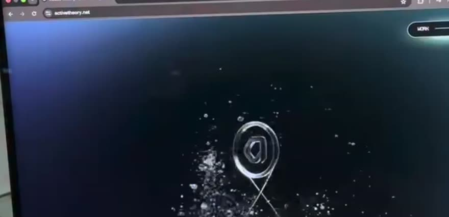
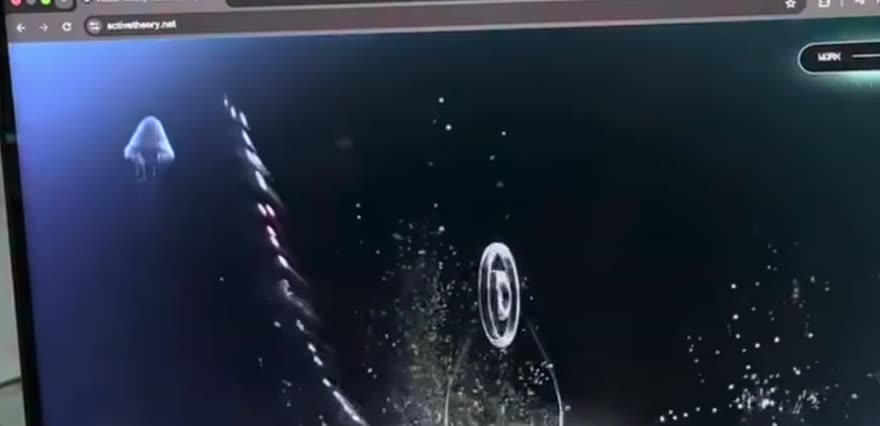
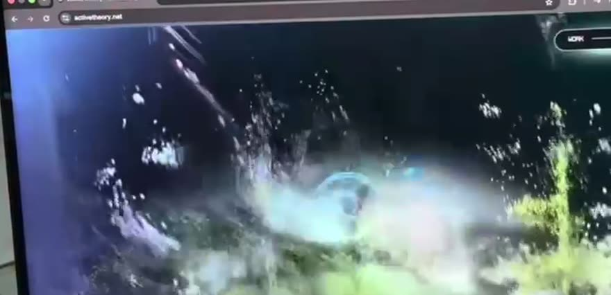

Camera coboară vertical printr-o coloană de apă. Lumina vine de sus; particulele albe urcă
prin cadru (mișcare relativă), semnalând viteza de coborâre. Sigla (torus chrome) plutește
în centru și rotește lent.

| Axă | Valoare |
|---|---|
| **Camera path** | `pos (0, 26, 14) → (0, 6, 9)` · `lookAt (0, 22, 0) → (0, 3, 0)` · traiectorie liniară cu ușor drift `x: 0 → 0.6` |
| **FOV** | `38° → 44°` (deschidere pe măsură ce accelerează) |
| **Obiecte active** | `logoTorus` (chrome), `driftParticles` (12k, additive), `jellyfishSplat`, `helixRibbon`, `filamentLines` (3 curbe Catmull-Rom), `seafloorSplat` (opacity 0 → 1) |
| **Pinning** | Pin activ de la `progress 0`. Nimic nu se scrollează nativ. |
| **Scroll distance** | 84vh |
| **Easing** | `power2.inOut` pe cameră · `none` (linear) pe particule pentru senzație de viteză constantă |
| **Depth** | `fog: FogExp2(#04141c, 0.028)` · plan apropiat z=6, plan îndepărtat z=−90 |
| **Scale** | `logoTorus.scale 0.55 → 0.85` |
| **Opacity** | `driftParticles 0 → 1` (0–15% din scenă) · `seafloorSplat 0 → 1` (60–100%) |
| **Masking** | Gradient vertical în shader-ul de fundal: `mix(#9fd8ea, #041018, smoothstep(0.15, 0.9, vUv.y))` |
| **Blur** | DoF: `focusDistance 0.055`, `bokehScale 3.2` — sigla e în focus, restul se destramă |
| **Rotations** | `logoTorus.rotation.y += progress * Math.PI * 1.4` · `.x` oscilează `sin(p*3)*0.12` |
| **Parallax ratios** | fundal `0.15` · splat mediu `0.45` · siglă `1.0` · particule foreground `1.65` |
| **Transitions** | Overlap 4% cu SCENE 02: `seafloorSplat` deja la opacity 1 când începe reveal-ul textului |
| **Shaders / post** | Bloom (`intensity 0.7`, `threshold 0.82`), Noise (`0.045`, additive), Vignette (`0.42`), DoF |
| **DOM** | Doar nav pill „WORK ——" (`position: fixed`, top-right, `opacity 0 → 1` în primele 3%) |
| **WebGL** | Tot restul |

---

### SCENE 02 — Hero type & liquid-metal mark · `12 – 26%`

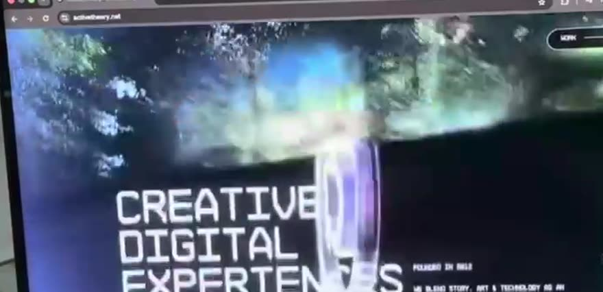
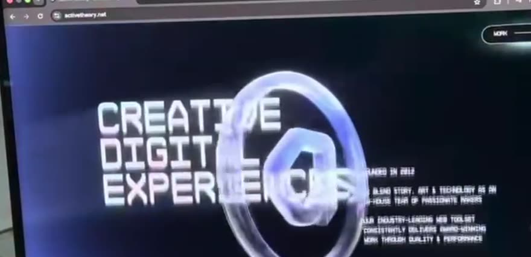
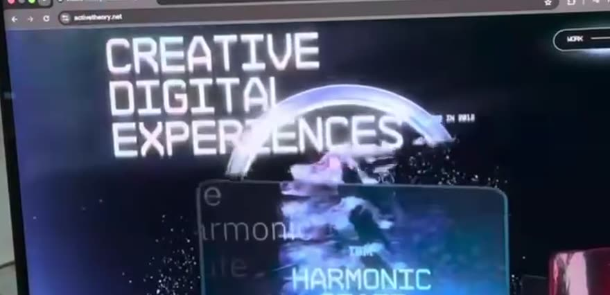

Camera se stabilizează. Titlul hero apare stânga-jos, coloana de microcopy dreapta.
Obiectul chrome se transformă din torus în formă lichidă (metaball / knot) și devine
elementul dominant. Titlul **crește** și urcă — pregătind ieșirea prin cameră.

| Axă | Valoare |
|---|---|
| **Camera path** | `pos (0.6, 6, 9) → (0.2, 4.2, 6.4)` · dolly-in pur, fără orbit |
| **FOV** | `44° → 40°` |
| **Obiecte active** | `chromeMark` (MeshPhysicalMaterial: `metalness 1`, `roughness 0.08`, `envMapIntensity 2.4`, `clearcoat 1`), `seafloorSplat`, `driftParticles` (densitate ↓ 40%) |
| **Pinning** | Pin continuu |
| **Scroll distance** | 98vh |
| **Easing** | `power3.out` pe cameră · `expo.out` pe reveal-ul textului · `power1.in` pe scale-out |
| **Depth** | `chromeMark z = −2.5` (între cameră și splat) · splat `z = −18` |
| **Scale** | Titlu DOM: `1 → 1.42` · `chromeMark.scale 1 → 1.35` |
| **Opacity** | Titlu `0 → 1` (12–17%), rămâne 1 până la 24%, apoi `1 → 0` (24–26%) · microcopy `0 → 1` cu delay 0.08 |
| **Masking** | Titlul revelat cu `clip-path: inset(0 0 100% 0) → inset(0 0 0% 0)` per linie, stagger `0.06` |
| **Blur** | Titlul: `filter: blur(14px) → blur(0)` la intrare; `blur(0) → blur(9px)` la ieșire (când depășește camera) |
| **Rotations** | `chromeMark.rotation.y: 0 → 2.4rad` · `.z: 0 → 0.35rad` |
| **Parallax ratios** | microcopy `0.55` · titlu `1.0` · chromeMark `1.25` · particule `1.6` |
| **Transitions** | Titlul nu dispare prin fade — **trece prin cameră** (scale + blur + opacity simultan). Aceasta e semnătura tranziției. |
| **Shaders / post** | + ChromaticAberration `offset 0.0008 → 0.0022` (crește cu viteza scroll-ului) |
| **DOM** | `h1` „CREATIVE DIGITAL EXPERIENCES" (3 linii, mask per linie) · coloană microcopy mono („FOUNDED IN 2012" + 2 paragrafe) · nav pill |
| **WebGL** | chromeMark, splat, particule, fundal |

---

### SCENE 03 — Camera enters the display · `26 – 39%`

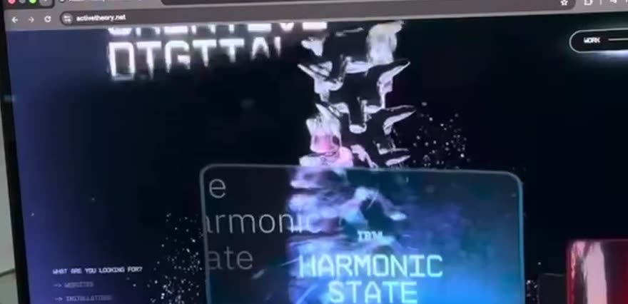
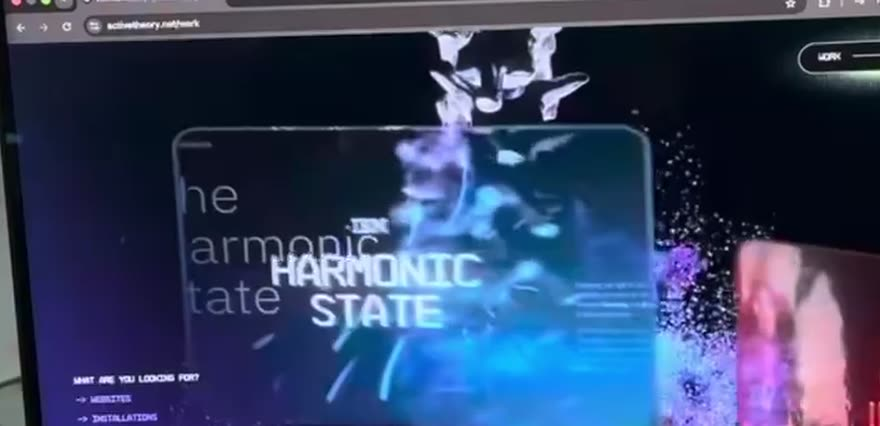

Momentul-cheie. O **coloană verticală de cioburi chrome** cade prin centrul cadrului și
funcționează ca wipe 3D. În spatele ei, primul card de proiect urcă în cadru. Titlul secțiunii
anterioare persistă ca **text-fantomă supradimensionat**, ocluzat parțial de card.

| Axă | Valoare |
|---|---|
| **Camera path** | `pos (0.2, 4.2, 6.4) → (0, 2.6, 3.0)` · `lookAt` coboară `(0,4,0) → (0,1.2,−4)` |
| **FOV** | `40° → 52°` (spike — senzația de „intrare în ecran") |
| **Obiecte active** | `shardColumn` (48 instanțe `InstancedMesh`, chrome), `card[0]` (HARMONIC STATE), `coralSplat` (intră), `chromeMark` (iese) |
| **Pinning** | Pin continuu |
| **Scroll distance** | 91vh |
| **Easing** | `power4.inOut` pe FOV · `power2.out` pe intrarea cardului · `none` pe căderea cioburilor |
| **Depth** | shardColumn `z = 1.5` (în fața cardului) · card[0] `z = −3` · coralSplat `z = −8 … −26` |
| **Scale** | `card[0].scale 0.82 → 1` · `shardColumn.scale.y 0 → 1` |
| **Opacity** | `shardColumn 0 → 1 → 0` (curbă în clopot, vârf la 32%) · `card[0] 0 → 1` (28–34%) · text-fantomă `0.22` constant |
| **Masking** | Cardul are `roundedRectMask` în fragment shader (`radius 0.055` în UV). Textul-fantomă e mascat de cardul opac — ocluzie reală în depth buffer, nu `z-index`. |
| **Blur** | Ieșirea hero: `blur 0 → 12px`. Radial blur (8 sample-uri) în post, `strength 0 → 0.35 → 0` |
| **Rotations** | `card[0].rotation.y: −0.42 → −0.08rad` · cioburile rotesc random `±2rad` pe toate axele |
| **Parallax ratios** | text-fantomă `0.35` · card `1.0` · cioburi `1.9` |
| **Transitions** | **Overlap 6%** cu SCENE 04 — cardul 0 este deja stabilizat când cardul 1 intră din dreapta |
| **Shaders / post** | Radial blur + Bloom `intensity 0.7 → 1.15` (spike pe cioburi) + ChromaticAberration `0.0035` la vârf |
| **DOM** | Sidebar „WHAT ARE YOU LOOKING FOR?" începe fade-in (34–39%) · text-fantomă e **DOM**, poziționat prin `camera.project()` |
| **WebGL** | cioburi, card, splat |

---

### SCENE 04 — Work carousel · `39 – 58%`

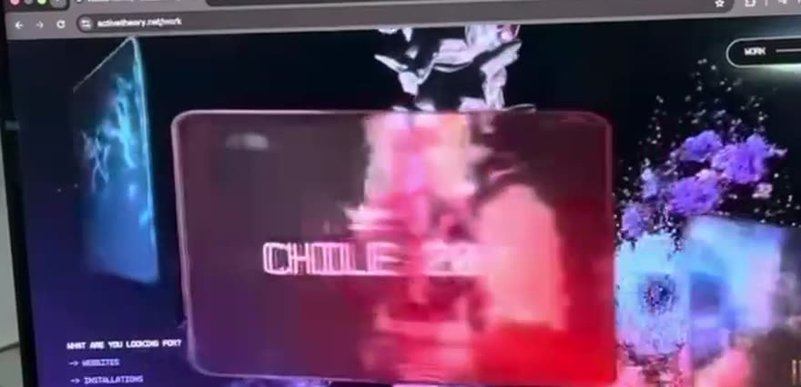
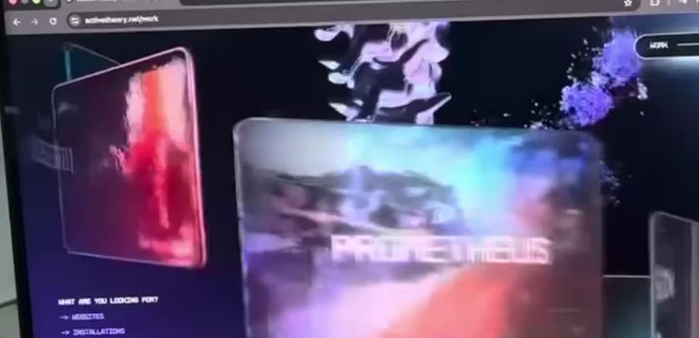
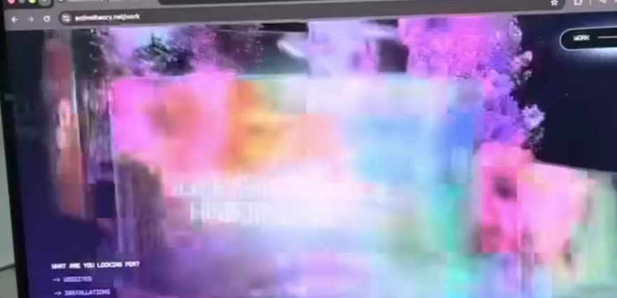

Camera se deplasează **lateral + în adâncime** printr-un raft orizontal de carduri video.
Cardurile sunt distribuite pe `x` la pas constant, dar cu `z` și `y` variate — de asta apar
în perechi/triplete la adâncimi diferite. Periodic camera **trece prin** un card (frame 11):
cardul umple ecranul, bloom-ul saturează, apoi rămâne în urmă.

| Axă | Valoare |
|---|---|
| **Camera path** | `pos.x: 0 → 12.5` (liniar) · `pos.z: 3.0 → 2.0` · `pos.y: 2.6 → 2.2` · `lookAt.x` urmărește cu lag 0.12 (camera „privește ușor înapoi") |
| **FOV** | `52° → 46°` |
| **Obiecte active** | `cards[0..5]` (video texture), `coralSplat` (dens, magenta/cyan), `driftParticles` (sparse) |
| **Pinning** | Pin continuu |
| **Scroll distance** | 133vh — cea mai lungă scenă |
| **Easing** | `none` (linear) pe deplasarea laterală → ritm constant, hipnotic. Easing doar pe micro-mișcări. |
| **Depth** | Carduri la `z ∈ {−1.2, −4.5, −8}`, pas `x = 4.2` · splat `z ∈ [−6, −30]` |
| **Scale** | Cardurile au `scale` fix (2.6 × 1.62). Percepția de scale vine **exclusiv din perspectivă**. |
| **Opacity** | Carduri: `1` constant · fade-out pe distanță prin `fog` · titlul cardului `0 → 1` când `|card.x − camera.x| < 3` |
| **Masking** | Rounded-rect în shader (`radius 0.055`) · rim fresnel `pow(1 − dot(N,V), 2.2) * 0.55` — chenarul subțire luminos |
| **Blur** | DoF cu `focusDistance` legat de cardul cel mai apropiat. Cardurile din spate: `bokehScale 4.5` |
| **Rotations** | `card.rotation.y = −0.10 − (card.x − camera.x) * 0.035` — cardurile se orientează subtil spre cameră |
| **Parallax ratios** | splat fundal `0.28` · carduri spate `0.62` · carduri față `1.0` · particule `1.55` |
| **Transitions** | Fără tăieturi. Fly-through-ul (frame 11) e un card la `z = 2.2`, deci camera îl traversează. Bloom-ul mascheaza planul de clipping. |
| **Shaders / post** | Bloom `1.15` · ChromaticAberration modulat de `Math.abs(scrollVelocity)` · Noise `0.05` · DoF |
| **DOM** | Sidebar fix stânga-jos: `WHAT ARE YOU LOOKING FOR?` → `→ WEBSITES / → INSTALLATIONS / → AR·VR·XR / → MULTIPLAYER / → GAMES` + buton pill `ASK US ANYTHING` · nav pill |
| **WebGL** | Carduri (inclusiv titlurile lor — sunt texturi/SDF în 3D, nu DOM), splat, particule |

---

### SCENE 05 — Spatial objects & orbit · `58 – 77%`

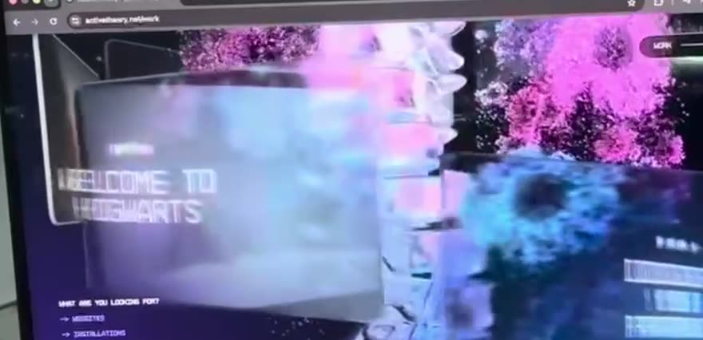
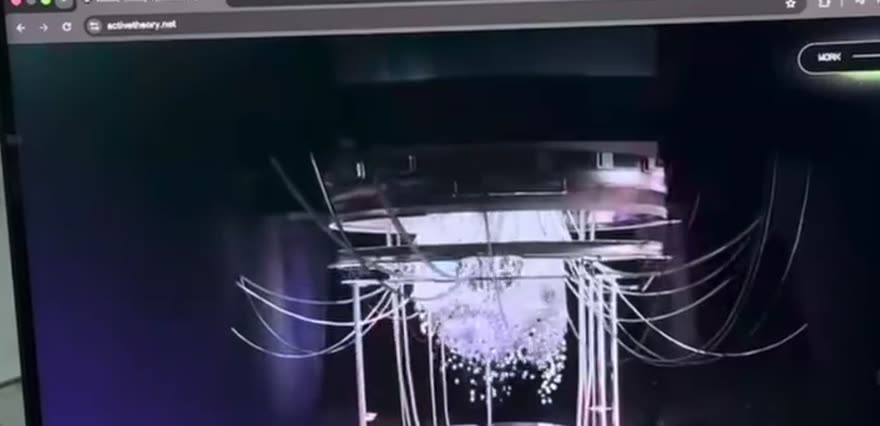

Camera începe să **orbiteze** în jurul rail-ului, nu doar să-l parcurgă. Cardurile se
desprind de planul lor și devin obiecte spațiale. Titlurile capătă **smear per-literă**
proporțional cu viteza de scroll (frame 12 — „DISCOVER YOUR PATRONUS" cu ecouri triple).

| Axă | Valoare |
|---|---|
| **Camera path** | Orbit parțial: `x = 12.5 + sin(t) * 5.5`, `z = 2.0 + (1 − cos(t)) * 4.0`, `t: 0 → 1.15rad` · `y: 2.2 → 3.1` |
| **FOV** | `46° → 42°` |
| **Obiecte active** | `cards[6..11]`, `coralSplat`, `chromeShards` (revin, sparse) |
| **Pinning** | Pin continuu |
| **Scroll distance** | 133vh |
| **Easing** | `sine.inOut` pe orbit (crucial — orice altceva se simte mecanic) |
| **Depth** | Cardurile se distribuie pe `z ∈ [−12, +1]` — profunzime maximă a experienței |
| **Scale** | `card.scale 1 → 1.18` pe cardul focalizat (cel mai aproape de axa camerei) |
| **Opacity** | Cardurile ne-focalizate `1 → 0.72` · splat `1 → 0.85` |
| **Masking** | Idem SCENE 04 + `alphaMap` de dizolvare pe marginile splat-ului |
| **Blur** | DoF agresiv: `focalLength 0.028`, `bokehScale 5.0`. Motion blur aproximat prin 3 copii offsetate ale titlului. |
| **Rotations** | `card.rotation.y` urmărește camera (billboard parțial, factor `0.35`) · `.z` drift `±0.06rad` |
| **Parallax ratios** | splat `0.30` · carduri `1.0` · cioburi `1.75` |
| **Transitions** | La 75% densitatea splat-ului scade brusc (`0.85 → 0.12`) — pregătește golul din SCENE 06 |
| **Shaders / post** | **Velocity smear**: `uSmear = clamp(scrollVelocity * 0.0009, 0, 0.03)`; titlul se randează de 3 ori cu offset `±uSmear` pe canalele R și B. + Bloom `1.25` + DoF |
| **DOM** | Sidebar (fix) · nav pill |
| **WebGL** | Carduri, titluri, splat, cioburi |

---

### SCENE 06 — Installations · return to depth collapse · `77 – 92%`

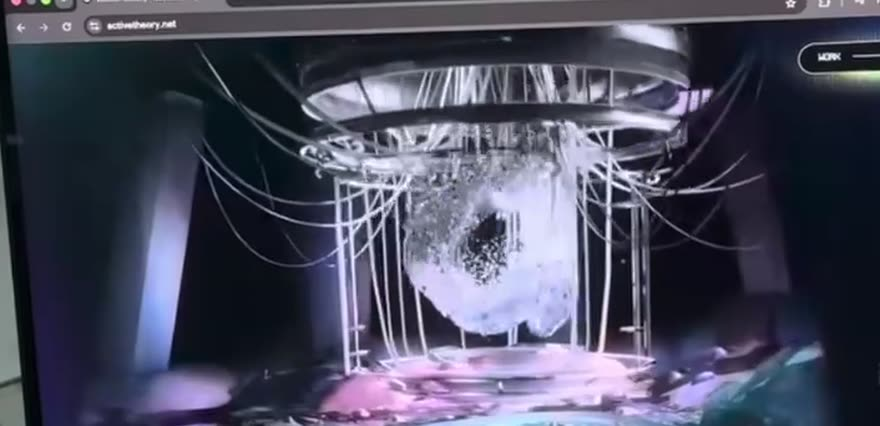
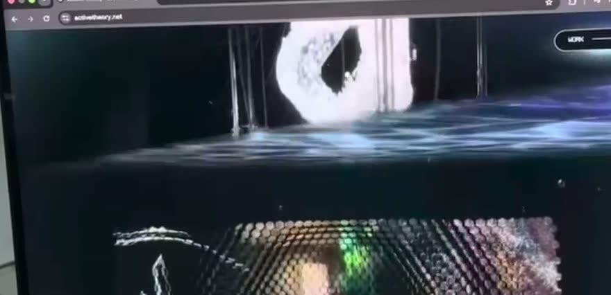

Norii de puncte colorați se golesc. Rămâne o scenă întunecată cu o **structură wireframe
suspendată** (instalație kinetică) reflectată într-o podea umedă. Adâncimea colapsează:
camera revine pe axa centrală, orbita se anulează.

| Axă | Valoare |
|---|---|
| **Camera path** | `pos → (0, 2.4, 5.2)` prin interpolare `sine.inOut` din poziția orbitală · `lookAt → (0, 2.0, −6)` |
| **FOV** | `42° → 36°` (colaps de perspectivă — comprimă spațiul) |
| **Obiecte active** | `installationRig` (LineSegments + 4.5k puncte), `wetFloor` (`MeshReflectorMaterial`, `blur [300,80]`, `mixStrength 22`), `coreBlob` (splat alb) |
| **Pinning** | Pin continuu |
| **Scroll distance** | 105vh |
| **Easing** | `power2.inOut` pe tot |
| **Depth** | Un singur plan focal `z = −6`. Fog dens `FogExp2(#030508, 0.05)` |
| **Scale** | `installationRig.scale 0.9 → 1.05` |
| **Opacity** | carduri `0.72 → 0` (77–81%) · `installationRig 0 → 1` (79–85%) · `coralSplat 0.12 → 0` |
| **Masking** | Reflexia din podea e un mask gradient vertical `smoothstep(0, 0.45, vUv.y)` |
| **Blur** | DoF se relaxează: `bokehScale 5.0 → 1.8`. Reflexia are blur propriu. |
| **Rotations** | `installationRig.rotation.y: −0.3 → 0.25rad` — pendulare lentă |
| **Parallax ratios** | reflexie `0.5` (invers) · rig `1.0` · fire/filamente `1.3` |
| **Transitions** | Boundary hard-edge (frame 15): panoul video de deasupra se termină, sub el începe secțiunea LAB. Este singura „tăietură" vizibilă — și e intenționată, ca un cut de montaj. |
| **Shaders / post** | Bloom `1.25 → 0.85` · ChromaticAberration `→ 0.0006` · Noise `0.05` · Vignette `0.5` |
| **DOM** | Sidebar iese (`opacity 1 → 0`, 77–80%) · nav pill |
| **WebGL** | Rig, podea, blob |

---

### SCENE 07 — THE LAB · CTA · settle · `92 – 100%`

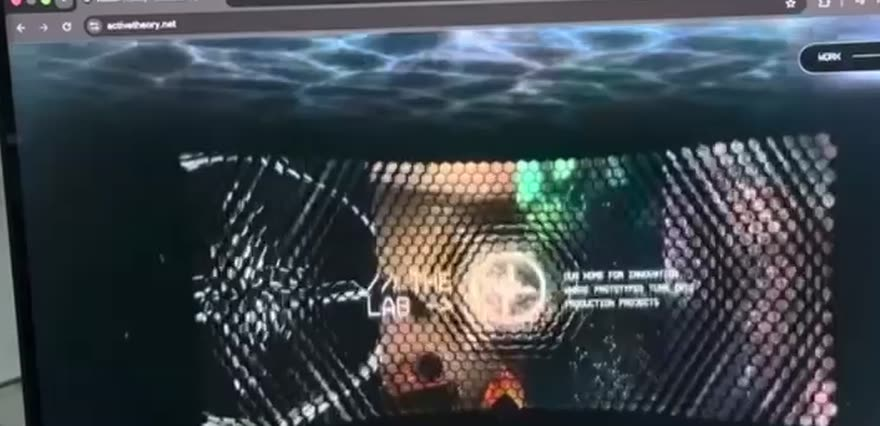
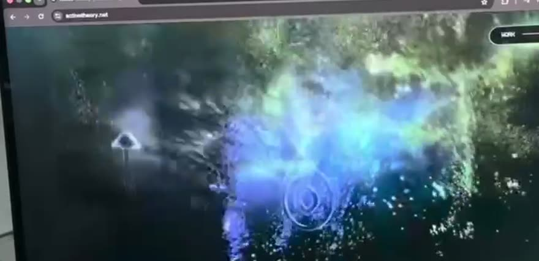
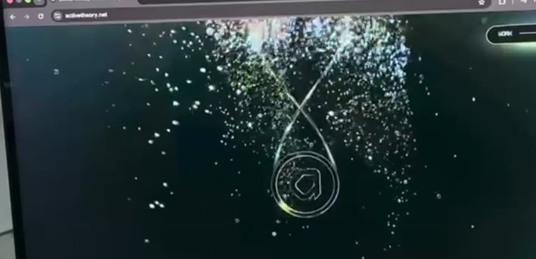

Panou full-bleed randat printr-un **shader halftone hexagonal**, cu o **lentilă circulară**
care rezolvă zona din jurul cursorului/centrului la rezoluție completă. Textul „THE LAB" +
copy stau în interiorul lentilei. Camera se așază, mișcarea se stinge, iar norul de puncte
inițial revine — bucla se închide.

| Axă | Valoare |
|---|---|
| **Camera path** | `pos (0, 2.4, 5.2) → (0, 2.0, 4.0)` · practic staționară. Ultimele 3% = zero mișcare. |
| **FOV** | `36° → 34°` |
| **Obiecte active** | `labPanel` (plan cu shader halftone), `revealLens`, `returnSplat` (norul din SCENE 01, opacity 0 → 0.6) |
| **Pinning** | Pin până la `progress 1`, apoi `pin: false` → pagina continuă normal (footer DOM) |
| **Scroll distance** | 56vh — cea mai scurtă, deliberat |
| **Easing** | `power3.out` — decelerare, niciodată `inOut` (ar reintroduce mișcare) |
| **Depth** | Panou plat la `z = −4`. Adâncimea colapsează complet. |
| **Scale** | `labPanel.scale 1.06 → 1` · `revealLens.radius 0 → 0.19 → 0.16` (uv space) |
| **Opacity** | `labPanel 0 → 1` (92–95%) · text în lentilă `0 → 1` (95–97%) · CTA `0 → 1` (97–100%) |
| **Masking** | **Lentila**: `float m = smoothstep(uRadius, uRadius - 0.045, distance(vUv, uLensCenter)); color = mix(halftone, rawVideo, m);` |
| **Blur** | `bokehScale → 0`. Fără DoF în ultimele 4%. |
| **Rotations** | Zero. Stabilitate totală. |
| **Parallax ratios** | Toate → `1.0`. Parallax-ul se anulează progresiv `92% → 100%`. |
| **Transitions** | Ultimul 8% este **decelerare pură**. Toate amplitudinile → 0. Scroll-ul devine din nou nativ. |
| **Shaders / post** | **Halftone hexagonal**: grid hex, `dotRadius = luminance(tex) * uCell * 0.62`. Bloom `0.85 → 0.55`. Noise `0.05 → 0.02`. |
| **DOM** | `h2` „THE LAB" · paragraf („OUR HOME FOR INNOVATION, WHERE PROTOTYPES TURN INTO PRODUCTION PROJECTS") · CTA final · footer |
| **WebGL** | labPanel, lens, returnSplat |

---

## 4. Reguli transversale (valabile în toate scenele)

### 4.1 Continuitate
- **Zero fade-to-black.** Nicio scenă nu se termină înainte să înceapă următoarea.
- Overlap standard: **4–6%** din progresul total între scene adiacente.
- Obiectele nu se distrug la finalul scenei; li se anulează opacity și ies din frustum.
- Un obiect care apare în scena N+1 începe să se încarce/estompeze în scena N.

### 4.2 Curba de energie
Ritmul nu e uniform. Energia (viteza camerei + intensitatea post-procesării) urmează:

```
S01 ▁▃▅  accelerare
S02 ▅▄▃  stabilizare
S03 ▃▇█  spike (intrarea în ecran)
S04 ▆▆▆  platou constant, hipnotic
S05 ▆▇▇  crescendo, orbit
S06 ▇▄▂  colaps
S07 ▂▁▁  liniște
```

### 4.3 Velocity-driven effects
Un singur `scrollVelocity` calculat o dată pe frame alimentează:
- `chromaticAberration.offset = 0.0008 + |v| * 0.000012` (clamp la `0.004`)
- `bloom.intensity += |v| * 0.00008`
- `textSmear = clamp(|v| * 0.0009, 0, 0.03)`
- `particleStretch = clamp(|v| * 0.002, 0, 1.4)` (particulele se alungesc pe direcția mișcării)

### 4.4 DOM vs WebGL — regula de decizie

| Rămâne DOM | Devine WebGL |
|---|---|
| Titluri hero (accesibilitate, SEO, selectabile) | Titlurile cardurilor (trebuie să respecte perspectiva) |
| Microcopy, sidebar, listă servicii | Orice text care se deformează/smear-uiește |
| Nav pill, CTA-uri, butoane | Text-fantomă? **DOM**, poziționat prin `camera.project()` |
| Footer, conținut post-pin | Tot ce e nor de puncte / material / reflexie |

**Ancorare DOM→3D:**
```js
const v = new THREE.Vector3().copy(anchor3D).project(camera);
el.style.transform = `translate3d(${(v.x*0.5+0.5)*w}px, ${(-v.y*0.5+0.5)*h}px, 0)
                      scale(${THREE.MathUtils.clamp(2.2/camera.position.distanceTo(anchor3D), .4, 2)})`;
el.style.opacity = v.z < 1 ? 1 : 0; // cull în spatele camerei
```

### 4.5 Palete
Referința folosește cyan→teal (S01), violet→magenta (S03–S05), alb rece (S06–S07).
Pentru AVYRON se mapează direct pe tokenii existenți din `src/index.css`:

| Rol | Token AVYRON | HSL |
|---|---|---|
| Nor primar / accent | `--brand` | `264 90% 62%` |
| Nor secundar / adâncime | `--brand-2` | `200 95% 55%` |
| Nor terțiar / highlight | `--brand-3` | `330 85% 65%` |
| Bloom / rim light | `--brand-glow` | `264 100% 75%` |
| Fundal scenă | `--background` (dark) | `222 25% 7%` |

---

## 5. Performanță

**Buget:** 60fps pe M1 / RTX 3060, 30fps floor pe integrat. `< 2.5s` până la primul frame.

| Măsură | Implementare |
|---|---|
| DPR cap | `renderer.setPixelRatio(Math.min(devicePixelRatio, 2))`; `1.5` pe mobil |
| Splat budget | ≤ 900k splats desktop / ≤ 220k mobil; LOD pe distanță |
| Instancing | Toate cioburile și particulele → `InstancedMesh` / `Points`, un singur draw call |
| Texturi video | `VideoTexture` la 720p, `format: RGBFormat`, doar cardurile din frustum sunt `play()`-ate |
| Frustum culling | Manual pe carduri: `if (Math.abs(card.x - camera.x) > 18) card.visible = false` |
| GC | Zero alocări în `raf`: `Vector3`/`Quaternion` pre-alocate ca module-scope |
| Post-processing | `multisampling: 0` + FXAA manual; DoF la half-res |
| Adaptive quality | Dacă `avgFrameTime > 22ms` timp de 60 frame-uri → drop DoF, apoi bloom `resolutionScale 0.5`, apoi splat LOD |
| `prefers-reduced-motion` | **Fallback obligatoriu**: fără pin, fără scrub. Scenele devin secțiuni statice cu poster-image + fade-in simplu. |
| Fallback WebGL absent | Detectare `WEBGL.isWebGL2Available()` → layout static, aceleași texte, `` în loc de canvas. SEO neafectat (textele sunt DOM). |
| Mobil | Timeline redus: S01+S02 fuzionează, S05 (orbit) devine deplasare liniară, splat → point cloud clasic 60k |

---

## 6. Ordinea de implementare recomandată

1. **Schelet** — Lenis + GSAP ScrollTrigger + pin + un cub care se mișcă. Validează `progress`.
2. **Camera rig** — traseul complet pe toate 7 scenele, cu un `AxesHelper` ca subiect. *Aici se joacă tot filmul.*
3. **Cardurile** — geometrie, rounded-rect shader, rim fresnel, video texture, distribuție pe rail.
4. **Sincronizarea DOM** — titluri, mask-uri, sidebar, ancorare `camera.project()`.
5. **Norii volumetrici** — splats (sau `Points` GPGPU ca prim pas).
6. **Post-processing** — Bloom → DoF → ChromaticAberration → Noise → Vignette, în ordinea asta.
7. **Velocity effects** — smear, aberație dinamică, stretch particule.
8. **Tuning** — easing-uri, overlap-uri, curba de energie. *Aici se câștigă senzația de „cinematic".*
9. **Performanță & fallback-uri.**

> Pașii 1–4 dau 70% din efect. Nu trece la 5 înainte ca traseul camerei să se simtă bine
> cu geometrie primitivă.

---

## 7. Cadre de referință

Toate cadrele extrase: [`./frames/`](./frames) — 18 cadre-cheie, 880px lățime,
decupate la zona ecranului, cu timecode în numele fișierului conform tabelului din §2.

Comanda de extragere (reproductibilă):
```bash
ffmpeg -ss <t> -i reference.mp4 -frames:v 1 \
  -vf "crop=706:342:7:14,scale=880:-1:flags=lanczos" -q:v 4 out.jpg
```
